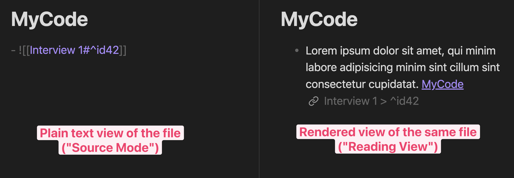

# Quadro – Qualitative Data analysis Realized in Obsidian


Obsidian plugin for social-scientific Qualitative Data Analysis (QDA). An open
alternative to [MAXQDA](https://www.maxqda.com/) and
[atlas.ti](https://atlasti.com/), using Markdown to store data and research
codes.

Quadro supports both, coding in the style of *Grounded Theory* and extraction in
the style of *Qualitative Content Analysis*.

## Table of Contents

<!-- toc -->

- [Introduction](#introduction)
	* [For academics not familiar with Obsidian](#for-academics-not-familiar-with-obsidian)
	* [For Obsidian users](#for-obsidian-users)
	* [Brief methodological comparison with other QDA software](#brief-methodological-comparison-with-other-qda-software)
- [Coding](#coding)
	* [How coding works in Quadro](#how-coding-works-in-quadro)
	* [Coding capabilities](#coding-capabilities)
- [Extraction](#extraction)
	* [How extraction works in Quadro](#how-extraction-works-in-quadro)
	* [Extraction capabilities](#extraction-capabilities)
- [Installation](#installation)
- [Development](#development)
	* [Roadmap](#roadmap)
	* [Build](#build)
- [Credits](#credits)
	* [Acknowledgments](#acknowledgments)
	* [Recommended citation](#recommended-citation)
	* [About the developer](#about-the-developer)

<!-- tocstop -->

## Introduction

### For academics not familiar with Obsidian
This plugin utilizes the rich text-processing capabilities of
[Obsidian](https://obsidian.md/) to provide a lightweight application for
qualitative data analysis.

All data is stored as [Markdown](https://www.markdownguide.org/) files.
**Markdown** is a human-readable, non-proprietary, and commonly used open
standard for plaintext files. This means:
- There is no lock-in / dependency to a particular software, the data can be
  analyzed in any app supporting Markdown. (In fact, the data is stored in plain
  text and can thus even be opened with and read with `Notepad.exe` or
  `TextEdit.app`)
- The research data is therefore future-proof, fulfilling the requirement of
  long-term archiving of qualitative data. It is guaranteed that the data can
  still be read even in 50 years, a guarantee that does not exist for research
  conducted with proprietary research software such as `MAXQDA` or `atlas.ti`.
- The data is interoperable with other applications, meaning it can easily be
  combined with other text analysis tools such as
  [AntConc](https://www.laurenceanthony.net/software/antconc/), or with browser
  extensions like [MarkDownload](https://chromewebstore.google.com/detail/markdownload-markdown-web/pcmpcfapbekmbjjkdalcgopdkipoggdi)
  to fetch website contents.
- The markdown files are stored offline by default, meeting the key requirements
  for research ethics and protection of research data.

Being an Obsidian plugin, the Qualitative Data Analysis is embedded in the
extensive functionality and plugin ecosystem of Obsidian:
- The data analysis can employ the feature-set of Obsidian, which already has a
  strong focus on linked files. For instance, the [Graph
  View](https://help.obsidian.md/Plugins/Graph+view) can be used to create a
  visual network of codes, and [Outgoing
  Links](https://help.obsidian.md/Plugins/Outgoing+links) provides an overview
  of all data files a code is assigned to.
- The qualitative analysis is easily extended with a [comprehensive ecosystem of
  more than 1000 plugins](https://obsidian.md/plugins), for example
  [dataview](https://obsidian.md/plugins?id=dataview) for advanced data
  aggregation or [YTranscript](https://obsidian.md/plugins?id=ytranscript) for
  automatic fetching of YouTube video transcripts.
- All this allows the researcher to customize the analysis to the particular
  needs of their research. Case-specific adaption of research methods
  is a key demand of qualitative research (which strictly speaking is not
  truly fulfilled when using standardized, proprietary research software).
- Obsidian, as well as Quadro, both [have mobile support (Android and iOS)](https://obsidian.md/mobile).

If there is a more tech-savvy researcher in the research team, the advantages of
Quadro go even further:
- Being Open Source, this plugin can be modified and customized to fit their
  needs. (It is written is TypeScript / JavaScript, a particularly accessible
  and commonly used programming language.)
- By storing the data in markdown files, all research data can be fully
  version-controlled with `git`.

Obsidian is [free to use for academic purposes](https://obsidian.md/license),
and Quadro is also free to use. Especially for students writing their
theses, this saves a lot of unnecessary hassle with licenses.

### For Obsidian users
*Coding* is implemented via "bidirectional" links between data files and
markdown files by inserting wikilinks at both files. It makes use of Obsidian's
[note-embedding](https://help.obsidian.md/Linking+notes+and+files/Embed+files#Embed+a+note+in+another+note)
functionality to keep track of coded text segments.
- Codes are implemented as `[[wikilinks]]` instead of `#tags`, as the former
  allows for more flexibility, such as having separate file per code.
- The distinct feature of this plugin is that its commands *always* make edits
  to two files (the data and the code file) *at the same time*, which is
  necessary to adequately handle the workflow common to coding in QDA.

*Extraction* is implemented by creating separate extract files containing, where
extraction aspects are saved as ([YAML frontmatter](https://docs.zettlr.com/en/core/yaml-frontmatter/)).

> [!TIP]
> It is recommended to create a separate vault for data analysis and install the
> plugin there, since QDA does not follow the "common logic of note-taking,"
> thus often requiring a different set of plugins and settings from your regular
> vault.

### Brief methodological comparison with other QDA software

**Advantages**
- **Interoperability**: Can be freely combined with other QDA software.
- **Flexibility**: You can use codes, extractions, or freely combine both.
- **Customizability**: Implicit assumptions of QDA software, such as the initial
  order in which codes are presented in the code selection modal, can be
  customized to deal with different kinds of coder biases.

**Disadvantages**
- The unit of coding is restricted to paragraphs and, to a degree, segments of a
  paragraph. Coding of initial words is not supported.
- Due to the nature of Markdown markup, partially overlapping code segments are
  not supported.

## Coding

### How coding works in Quadro
There are two basic types of files for the analysis, Data Files and Code Files,
which are both stored as [Markdown files](https://www.markdownguide.org/).

**Data Files**
The empirical material as text files. They can be stored anywhere in the vault
as `.md` files. (A separate subfolder named `Data` is recommended though.) As
Quadro assigns codes to whole paragraphs, these data files should
be split up into smaller segments.

When a code is assigned, a link to the corresponding Code File and a unique
ID are appended to the paragraph:

```md
Filename: Data/Interview 1.md

Lorem ipsum dolor sit amet, qui minim labore adipisicing minim sint cillum sint
consectetur cupidatat. [[MyCode]] ^id42
```

**Code Files**
All markdown files in the folder `{vault-root}/Codes` are considered code
files.

When a code is assigned, a link back to the original location in the data file
is appended to the code file.

```md
Filepath: Codes/MyCode.md

![[Interview 1#^id42]]
```

As the link is a so-called [embedded
link](https://help.obsidian.md/Linking+notes+and+files/Embed+files#Embed+a+note+in+another+note),
Obsidian renders the respective paragraph of the data file inside the code
file:



> [!NOTE]
> The main caveat of this approach is that the assignment of codes is mostly
> restricted to the paragraph level. Assigning codes to only segments of a
> paragraph is limited to adding highlights to the respective section.
> Assignment of codes to individual words and coded segments with overlap are
> not supported.

### Coding capabilities

| Action                               | Notes                                                                                                                                                |           Sidebar Button           | Default Hotkey | Capability Provider                             |
| ------------------------------------ | ---------------------------------------------------------------------------------------------------------------------------------------------------- | :--------------------------------: | :------------: | ----------------------------------------------- |
| Assign code                          | Assign a code to the current paragraph, any selected text is highlighted. (overlapping highlights not supported though).                             |   | `mod+shift+c`  | Quadro                                          |
| Create new code                      | When assigning code, select `Create new code` in the code selection modal. Using `/` places the code file in a subfolder.                            |   | `mod+shift+c`  | Quadro                                          |
| Rename code                          | All references to the code file are automatically updated. Can also rename by right-clicking a file or link and selecting "Rename."                  |      | `mod+shift+r`  | [Obsidian Built-in][rename]                     |
| Remove code from paragraph           | Removes a code from the current paragraph of a data or code file. The reference is also removed from the corresponding other file.                   |  | `mod+shift+u`  | Quadro                                          |
| Merge codes                          | All references to the code file are automatically updated.                                                                                           |         | `mod+shift+m`  | [Obsidian Core Plugin: Note Composer][composer] |
| Code grouping                        | Codes can simply be arranged in subfolders via drag-and-drop in the File Explorer.                                                                   |                 —                  | —              | Obsidian Built-in                               |
| Visualization of code relationships  | In the Graph View, use a query like `path:Codes OR path:Data`, and assign Data and Codes to different groups. <br><br>[Further Documentation][graph] |      | `mod+g`        | [Obsidian Core Plugin: Graph View][graph]       |
| Investigation of code co-occurrences | In the Obsidian Search, use a query such as `line:([[MyCodeOne]] [[MyCodeTwo]])`. <br><br>[Further Documentation][search]                            |                 —                  | `mod+shift+f`  | [Obsidian Core Plugin: Search][search]          |

[composer]: https://help.obsidian.md/Plugins/Note+composer
[rename]: https://help.obsidian.md/Files+and+folders/Manage+notes#Rename+a+note
[graph]: https://help.obsidian.md/Plugins/Graph+view
[search]: https://help.obsidian.md/Plugins/Search#Search+operators

`mod` refers the `ctrl` on Windows and to `cmd` on macOS. Every hotkey can be
customized by search in the Obsidian hotkey settings.

> [!WARNING]
> Renaming, or moving Code/Data Files **must** be done from within
> Obsidian. Doing so in the Windows Explorer or macOS Finder does not trigger
> the automatic updating of references, meaning a loss of information.

## Extraction

### How extraction works in Quadro
Extraction is implemented similarly to coding, using two basic file types, Data
Files and Extraction Files.

**Data Files**
The empirical material as text files. They can be stored anywhere in the vault
as `.md` files.

When making an extraction, a link to the corresponding Extraction File and a
unique ID are appended to the paragraph, just like with coding:

```md
Filename: Data/Interview 2.md

Lorem ipsum dolor sit amet, qui minim labore adipisicing minim sint cillum sint
consectetur cupidatat. [[Extraction 1]] ^id23
```

**Extraction Files**
Extraction is implemented via Markdown metadata ([YAML frontmatter](https://docs.zettlr.com/en/core/yaml-frontmatter/)),
which is supported via [Obsidian Properties](https://help.obsidian.md/Editing+and+formatting/Properties).

When making an extraction, a new file is created in the folder
`{vault-root}/Extractions`. As such, each file corresponds to a single extraction.

The metadata keys correspond to the input fields of the extraction form. The
`source` key contains a link back to the corresponding Data File.

```md
Filepath: Extractions/Extraction 1.md

---
dimension_one: "value"
dimension_two: "another value"
source: "[[Interview 2#^id23]]"
---

Some optional notes.
```

### Extraction capabilities

| Action              | Notes | Default Hotkey | Command Name | Capability Provider                     |
| ------------------- | ----- | -------------- | ------------ | --------------------------------------- |
| Extract information | TODO  | /              | /            | Quadro                                  |
| Data aggregation    | TODO  | /              | /            | [Community Plugin: Dataview][dataview]              |

[dataview]: https://blacksmithgu.github.io/obsidian-dataview/

Every hotkey can be customized by search in the Obsidian hotkey settings for the
command name.

## Installation
**Manual**
1. Download the `.zip` file from the [latest
   release](https://github.com/chrisgrieser/obsidian-quadro/releases/latest).
2. Extract the `.zip` file into the
   `{your-vault-path}/.obsidian/plugins/quadro`. (Note that on macOS,
   `.obsidian` is a hidden folder. You can make hidden folders visible by
   pressing `cmd+shift+.` in the Finder.)
3. In Obsidian, go to `Settings` → `Community Plugins`. Press the Refresh
   button.
4. Look for a new entry `Quadro` in the plugin list. Enable the plugin by
   checking the box.

Alternatively, if you are already familiar with the Obsidian Ecosystem, you can
also install the plugin via [BRAT](https://github.com/TfTHacker/obsidian42-brat).

**Obsidian Community Plugin Store**
When published in the Obsidian Community Store, it is going to be available in
Obsidian's Plugin Browser via: `Settings` → `Community Plugins` → `Browse` →
Search for *"Quadro"*

## Development

### Roadmap
- [ ] Delete Codes Completely.
- [ ] Bulk Create Codes.
- [ ] Implement Extraction.
- [ ] Example Vault.
- [ ] Submit to Obsidian Community Plugin Store.

### Build

```bash
git clone "git@github.com:chrisgrieser/obsidian-quadro.git"
make init
```

<!-- vale Google.FirstPerson = NO -->
## Credits

### Acknowledgments
- [Ryan Murphy](https://fulcra.design/About/) who gave me the idea for this
  project with a [blogpost of
  his](https://fulcra.design/Posts/An-Integrated-Qualitative-Analysis-Environment-with-Obsidian/).
- [Grit Laudel](http://www.laudel.info/) for providing sample interview data.# Acknowledgments

### Recommended citation
Please cite this software project as (APA):

```txt
Grieser, C. (2024). Quadro – Qualitative Data Analysis Realized in Obsidian [Computer software]. 
https://github.com/chrisgrieser/obsidian-qualitative-data-analysis
```

For other citation styles, use the following metadata:
- [Citation File Format (.cff)](./recommended-citation/CITATION.cff)
- [BibTeX (.bib)](./recommended-citation/CITATION.bib)

### About the developer
I am a sociologist studying the social mechanisms underlying the
digital economy. For my PhD project, I investigate the governance of the app
economy and how software ecosystems manage the tension between innovation and
compatibility. If you are interested in this subject, feel free to get in touch.

- [Academic Website](https://chris-grieser.de/)
- [ResearchGate](https://www.researchgate.net/profile/Christopher-Grieser)
- [Discord](https://discordapp.com/users/462774483044794368/)
- [GitHub](https://github.com/chrisgrieser/)
- [Twitter](https://twitter.com/pseudo_meta)
- [Mastodon](https://pkm.social/@pseudometa)
- [LinkedIn](https://www.linkedin.com/in/christopher-grieser-ba693b17a/)

<a href='https://ko-fi.com/Y8Y86SQ91' target='_blank'>
</a>
