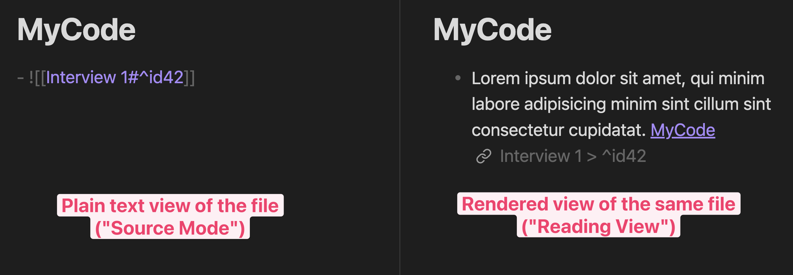
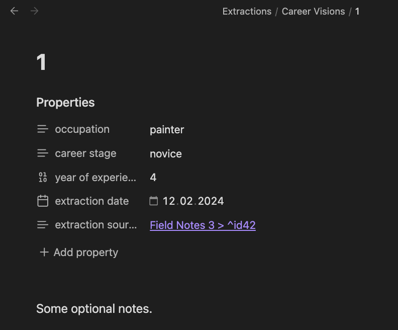

# Quadro


***Qua**litative **D**ata analysis **R**ealized in **O**bsidian*

Quadro is an Obsidian plugin for social-scientific qualitative data analysis
(QDA). It is an open alternative to [MAXQDA](https://www.maxqda.com/) and
[atlas.ti](https://atlasti.com/), using Markdown to store data and codes.

The plugin supports coding in the tradition of Grounded Theory, and data
extraction following the principles of Qualitative Content Analysis (as outlined
by [Gläser and Laudel](https://doi.org/10.17169/fqs-20.3.3386)).

## Table of contents

<!-- toc -->

- [Introduction](#introduction)
    - [For academics not familiar with Obsidian](#for-academics-not-familiar-with-obsidian)
    - [For Obsidian users not familiar with QDA](#for-obsidian-users-not-familiar-with-qda)
    - [Brief methodological comparison with other QDA software](#brief-methodological-comparison-with-other-qda-software)
- [Usage](#usage)
    - [Getting started](#getting-started)
        - [Basics for academics new to Obsidian](#basics-for-academics-new-to-obsidian)
        - [Example vault for Quadro](#example-vault-for-quadro)
        - [Experienced Obsidian users](#experienced-obsidian-users)
        - [Using a separate vault](#using-a-separate-vault)
        - [Migrating from an existing project with other QDA software](#migrating-from-an-existing-project-with-other-qda-software)
    - [Modification of Obsidian core behavior](#modification-of-obsidian-core-behavior)
    - [Coding](#coding)
        - [How coding works in Quadro](#how-coding-works-in-quadro)
        - [Coding capabilities](#coding-capabilities)
    - [Extraction](#extraction)
        - [How extraction works in Quadro](#how-extraction-works-in-quadro)
        - [Aggregate extractions](#aggregate-extractions)
        - [Extraction capabilities](#extraction-capabilities)
    - [Auxiliary commands](#auxiliary-commands)
        - [Open random Data Files](#open-random-data-files)
        - [Progress tracking & theoretical saturation](#progress-tracking--theoretical-saturation)
- [Configuration](#configuration)
    - [Buttons](#buttons)
    - [Hotkeys](#hotkeys)
    - [Plugin behavior](#plugin-behavior)
- [Installation & update](#installation--update)
- [Development](#development)
    - [Contribute](#contribute)
    - [CSS classes](#css-classes)
- [Credits](#credits)
    - [Acknowledgments](#acknowledgments)
    - [Recommended citation of this project](#recommended-citation-of-this-project)
    - [About the developer](#about-the-developer)

<!-- tocstop -->

## Introduction

### For academics not familiar with Obsidian
This plugin utilizes the rich text-processing capabilities of
[Obsidian](https://obsidian.md/) to provide a lightweight application for
qualitative data analysis.

All data is stored as [Markdown](https://www.markdownguide.org/) files.
**Markdown** is a human-readable, non-proprietary, and commonly used open
standard for plain text files. This means:
- There is no lock-in / dependency to a particular app, the data can be
  analyzed in any app supporting Markdown. (In fact, the data is stored in
  plaintext and can thus even be opened with and read with `Notepad.exe` or
  `TextEdit.app`.)
- The research data is therefore future-proof, fulfilling the requirement of
  long-term archiving of qualitative data. It is guaranteed that the data can
  still be read even in 50 years, a guarantee that does not exist for research
  conducted with proprietary research software such as `MAXQDA` or `atlas.ti`.
- The data is interoperable with other applications, meaning it can easily be
  combined with other text analysis tools such as
  [AntConc](https://www.laurenceanthony.net/software/antconc/).
- The Markdown files are stored offline by default, meeting key requirements for
  research ethics and protection of research data.

Being an Obsidian plugin, the Qualitative Data Analysis is embedded in the
extensive functionality and plugin ecosystem of Obsidian:
- The data analysis can employ the feature-set of Obsidian, which already has a
  strong focus on linked files. For instance, the [Graph
  View](https://help.obsidian.md/Plugins/Graph+view) can be used to create a
  visual network of codes, and [Outgoing
  Links](https://help.obsidian.md/Plugins/Outgoing+links) provides an overview
  of all data files a code is assigned to.
- The qualitative analysis is easily extended with a [comprehensive ecosystem of
  more than 1000 plugins](https://obsidian.md/plugins), for example
  [Projects](https://obsidian.md/plugins?id=obsidian-projects) for advanced data
  aggregation, or [Relay](https://github.com/no-instructions/relay) for
  live-collaboration like in `Google Docs`.
- Obsidian has been
  [stress tested and confirmed to be able to handle 20 000+ files](https://www.reddit.com/r/ObsidianMD/comments/zrzqq0/testing_the_scalability_of_obsidian_with_large/).
- All this allows the researcher to customize the analysis to the particular
  needs of their research. Case-specific adaption of research methods
  is a key demand of qualitative research (which strictly speaking is not
  truly fulfilled when using standardized, proprietary research software).
- Obsidian, as well as *Quadro*, both
  [have mobile support (Android and iOS)](https://obsidian.md/mobile).
- Using Obsidian allows you to employ a keyboard-driven workflow with minimal
  usage of the mouse.

Obsidian is [free to use for academic purposes](https://obsidian.md/license),
and *Quadro* is also free to use.
- Especially for students writing their theses, this saves a lot of unnecessary
  hassle with licenses.
- Unlicensed use of research software can lead to [journal articles being
  retracted](https://retractionwatch.com/2024/11/08/complaint-from-engineering-software-company-prompts-two-retractions/).
  Using free or open source tools like *Quadro* avoids this issue entirely.

If there is a more tech-savvy researcher in the research team, the advantages of
*Quadro* go even further:
- Being Open Source, this plugin can be modified and customized to fit their
  needs. (It is written is TypeScript / JavaScript, a particularly accessible
  and commonly used programming language.)
- By storing the data in Markdown files, all research data can be fully
  version-controlled with `git`.

### For Obsidian users not familiar with QDA
In qualitative data analysis, "coding" is a form of fine-grained tagging of text
segments, and "extraction" denotes the transforming of prose text into
structured data.

*Coding* is implemented in *Quadro* via "bidirectional" links between Data Files
and Code Files by inserting wikilinks in *both* files. (Obsidian itself does
have backlinks, but those are unidirectional links, since the implicit backlink
is only inferred and not stored anywhere in the Markdown file.).

It makes use of Obsidian's
[note-embedding](https://help.obsidian.md/Linking+notes+and+files/Embed+files#Embed+a+note+in+another+note)
functionality to keep track of coded text segments.
- Codes are implemented as `[[wikilinks]]` instead of `#tags`, as the former
  allows for more flexibility, such as having separate file per code.
- The distinct feature of this plugin is that its commands *always* make edits
  to two files (the data and the code file) *at the same time*, which is
  necessary to adequately handle the workflow common to coding in QDA.

*Extraction* is implemented by creating separate Extract Files for each
extraction, using [YAML
frontmatter](https://docs.zettlr.com/en/core/yaml-frontmatter/) to store the
data in a structured form. Quadro uses a simplistic templating mechanism to
support the creation of those Extraction Files.

### Brief methodological comparison with other QDA software
**Advantages** <!-- rumdl-disable-line MD036 -->
- **Interoperability**: Can be freely combined with other QDA software.
- **Flexibility**: You can use codes, extractions, or freely combine both.
- **Customizability**: Implicit assumptions of QDA software, such as the initial
  order in which codes are presented in the code selection modal, can be
  customized to deal with different kinds of coder biases.
- **Extensibility**: *Quadro* can be easily extended via the Obsidian plugin
  ecosystem. As opposed to other research software, extending the functionality
  in most cases does not require technical expertise coding experience.

**Disadvantages** <!-- rumdl-disable-line MD036 -->
- The **unit of coding** is restricted to paragraphs and to a degree segments
  of a paragraph. Coding of individual words is not supported.
- Due to the nature of Markdown markup, assigning multiple codes to
  **partially overlapping paragraph segments** is not supported. This
  restriction only applies to *partial overlaps*, assigning multiple codes to
  the same paragraph or segment works, of course.

## Usage

### Getting started

#### Basics for academics new to Obsidian
- You should familiarize yourself with
  [Markdown](https://help.obsidian.md/Getting+started/Glossary#Markdown), a
  simple standard for human-readable text files, such as `**bold text**` for
  **bold text**.
- A ["vault"](https://help.obsidian.md/Getting+started/Glossary#Vault) is a
  local folder on your device that Obsidian uses as project folder. Obsidian
  configurations are on a per-vault-basis, so you can have separate
  configurations for your note-taking and for your data analysis.

<!-- rumdl-disable-next-line MD063 -->
#### Example vault for Quadro
There is a [pre-configured example
vault](https://github.com/chrisgrieser/obsidian-quadro) to be used with
*Quadro*. Apart from some preinstalled plugins for QDA, it includes some mock
data with exemplary codes and extractions, and showcases of extraction
capabilities, to demonstrate the capabilities of *Quadro*.

1. [Download the vault](https://github.com/chrisgrieser/quadro-example-vault/releases/latest/download/quadro-example-vault.zip).
2. Open the directory `quadro-example-vault` as an Obsidian vault. ([If you are
   new to Obsidian, see the Obsidian Documentation on how to do
   that.](https://help.obsidian.md/Getting+started/Create+a+vault#Open+existing+folder))

#### Experienced Obsidian users
If you are experienced with Obsidian, you can also directly install the plugin,
though checking out the example vault is nonetheless helpful to get a grasp on
the capabilities of *Quadro*.

#### Using a separate vault
It is recommended to create a separate vault for data analysis and
install the plugin there, for several reasons:
- QDA does not follow the common logic of note-taking, thus often requiring a
  different set of plugins and settings from your regular vault.
- Separate vaults mean that suggestions, such as for properties, are also
  separated.
- To make Obsidian easier to use for qualitative research, *Quadro* also does
  some (minor) modifications to the core Obsidian behavior, such as all file
  deletions being monitored.
- For archival purposes, the research data is already separated from your notes.
- For collaborative work in a research team, the data is stored separately
  from personal notes.

#### Migrating from an existing project with other QDA software
Unfortunately, this is not supported. The main reason is that commercial QDA
software uses proprietary formats, the exact reason why researchers should
use research software utilizing open formats to begin with.

If your research data is
saved in [Markdown, Obsidian is able to import
them](https://help.obsidian.md/import/markdown) though. Importing from [various
other note-taking apps like Notion, Evernote, OneNote, Google Keep, Apple Notes,
Bear, or Roam](https://help.obsidian.md/import) is supported as well.

It is, however, possible to export the results done with *Quadro*, to
collaborate with other researchers. You can either export individual files as
PDF, or [export aggregated results as CSV](#extraction-capabilities).

### Modification of Obsidian core behavior
To work correctly, *Quadro* modifies some behavior of Obsidian core:
- If a Code File or Extraction File is deleted, *Quadro* will remove all
  references to it to avoid leaving dead links.
- Since *Quadro* heavily relies on [block
  references](https://help.obsidian.md/Linking+notes+and+files/Internal+links.md#Link+to+a+block+in+a+note)
  and [embedded
  blocks](https://help.obsidian.md/Linking+notes+and+files/Embed+files.md#Embed+a+note+in+another+note),
  their styling is adapted.

As mentioned before it is recommended to use a separate vault for data analysis
with *Quadro*.

### Coding

<!-- rumdl-disable-next-line MD063 -->
#### How coding works in Quadro
There are two basic types of files for the analysis, Data Files and Code Files,
which are both stored as [Markdown files](https://www.markdownguide.org/).

**Data Files** <!-- rumdl-disable-line MD036 -->
The empirical material as text files. They can be stored anywhere in the vault
as `.md` files. (A separate subfolder named `Data` is recommended though.) As
*Quadro* assigns codes to whole paragraphs, these data files should
be split up into smaller segments.

When a code is assigned, a link to the corresponding Code File and a unique
ID are appended to the paragraph:

```md
Filename: ./Data/Interview 1.md

Lorem ipsum dolor sit amet, qui minim labore adipisicing minim sint cillum sint
consectetur cupidatat. [[MyCode]] ^id-240302-124012
```

**Code Files** <!-- rumdl-disable-line MD036 -->
All Markdown files in the folder `{vault-root}/Codes` are considered code
files. (The folder is configurable.)

When a code is assigned, a link back to the original location in the Data File
is appended to the code file. The link has the format
`[[{filename-datafile}#^{id-of-paragraph}]]`, with the `id` being a timestamp.
[^1]

```md
Filepath: ./Codes/MyCode.md

![[Interview 1#^id-240302-124012]]
```

As the link is a so-called [embedded
link](https://help.obsidian.md/Linking+notes+and+files/Embed+files#Embed+a+note+in+another+note),
Obsidian renders the respective paragraph of the Data File inside the Code
File:



The underlying folder structure for coding looks like this:

```txt
.
├── 📂 Data
│   ├── 📄 Interview 1.md
│   ├── 📄 Field Notes 1.md
│   └── …
└── 📂 Coding
    ├── 📄 code 1.md
    ├── 📄 code 2.md
    └── 📂 Group 1
         ├── 📄 code 3.md
         ├── 📄 code 4.md
         └── …
```

> [!NOTE]
> The main caveat of this approach is that the assignment of codes is mostly
> restricted to the paragraph level. Assigning codes to only segments of a
> paragraph is limited to adding highlights to the respective section.
> Assignment of codes to individual words and coded segments with overlap is
> not supported.

#### Coding capabilities
<!-- rumdl-disable MD033 for `<br>` -->

| Action                                    | Description                                                                                                                                                                                                                            |               Sidebar button               | Default hotkey | Capability provider                                                                                              |
| ----------------------------------------- | -------------------------------------------------------------------------------------------------------------------------------------------------------------------------------------------------------------------------------------- | :----------------------------------------: | :------------: | ---------------------------------------------------------------------------------------------------------------- |
| Assign code                               | Assign a code to the current paragraph, any selected text is highlighted. (overlapping highlights not supported though). <br><br>Select `Create new code` or press `shift ⏎` to create a new code file and assign it to the paragraph. |       | `mod+shift+a`  | Quadro                                                                                                           |
| Rename code                               | All references to the Code File are automatically updated. (You can also rename by right-clicking a file or link and selecting "Rename.")                                                                                              |      |                | [Obsidian Built-in][rename]                                                                                      |
| Delete code from paragraph                | Removes a code from the current paragraph of a Data File or Code File. The reference is also removed from the corresponding other file.                                                                                                |      | `mod+shift+d`  | Quadro                                                                                                           |
| Delete Code File and all references to it | Moves the Code File to the trash, *and* deletes all references to it.                                                                                                                                                                  |          |       —        | Quadro                                                                                                           |
| Bulk-create new codes                     | Create multiple new codes at once (without assigning them to a paragraph).                                                                                                                                                             |     |       —        | Quadro                                                                                                           |
| Merge codes                               | Merge the *current* Code File into another Code File. All references from data files are updated to point to the merged file.                                                                                                          |        |       —        | Quadro                                                                                                           |
| Code grouping                             | Codes can be arranged in subfolders via drag-and-drop in the File Explorer.                                                                                                                                                            |                     —                      |       —        | [Obsidian Built-in][move file]                                                                                   |
| Show code overview                        | Creates an auto-updating overview of all codes in a nested list with code assignment counts.                                                                                                                                           |      |       —        | Quadro                                                                                                           |
| Axial coding                              | Using the Canvas plugins, you can freely arrange entities on a board, and connect them via lines and arrows, suitable for Axial Coding. <br><br>[Further Documentation][core-canvas]                                                   |  |       —        | [Obsidian Core Plugin: Canvas][core-canvas]<br><br>[Obsidian Community Plugin: Semantic Canvas][semantic-canvas] |
| Investigation of code co-occurrences      | In the Obsidian Search, use a query such as `line:([[MyCodeOne]] [[MyCodeTwo]])`. <br><br>[Further Documentation][search]                                                                                                              |                     —                      | `mod+shift+f`  | [Obsidian Core Plugin: Search][search]                                                                           |
| Visualization of code relationships       | In the Graph View, use a query like `path:Codes OR path:Data`, and assign Data and Codes to different groups. <br><br>[Further Documentation][graph]                                                                                   |          |    `mod+g`     | [Obsidian Core Plugin: Graph View][graph]                                                                        |

<!-- rumdl-disable MD033 -->

[rename]: https://help.obsidian.md/Files+and+folders/Manage+notes#Rename+a+note
[graph]: https://help.obsidian.md/Plugins/Graph+view
[search]: https://help.obsidian.md/Plugins/Search#Search+operators
[move file]: https://help.obsidian.md/Plugins/File+explorer#Move+a+file+or+folder
[core-canvas]: https://help.obsidian.md/Plugins/Canvas
[semantic-canvas]: https://github.com/aarongilly/obsidian-semantic-canvas-plugin?tab=readme-ov-file#obsidian-semantic-canvas-plugin

- `mod` refers the `ctrl` on Windows and to `cmd` on macOS.
- When there is a file `Codes/Template.md`, its frontmatter is used as template
  for any newly created code.
- Splitting Code Files is not yet supported. Doing so with any other method
  (such as another plugin) is likely going to result in broken references.
- ⚠️ Renaming or moving Code/Data Files should be done from within Obsidian.
  Using the Windows Explorer or macOS Finder does not trigger the automatic
  updating of references, meaning a loss of information.

### Extraction
Quadro implements extraction following the principles of [Qualitative Content
Analysis as outlined by Gläser and
Laudel](https://doi.org/10.17169/fqs-20.3.3386).

<!-- rumdl-disable-next-line MD063 -->
#### How extraction works in Quadro
Extraction is implemented similarly to coding, using two basic filetypes, Data
Files and Extraction Files.

**Data Files** <!-- rumdl-disable-line MD036 -->
The empirical material as text files. They can be stored anywhere in the vault
as `.md` files.

When making an extraction, a link to the corresponding Extraction File and a
unique ID are appended to the paragraph, just like with coding:

```md
Filename: ./Data/Interview 2.md

Lorem ipsum dolor sit amet, qui minim labore adipisicing minim sint cillum sint
consectetur cupidatat. [[Career Visions/1]] ^id-240302-124012
```

**Extraction Files** <!-- rumdl-disable-line MD036 -->
Extraction is implemented via Markdown metadata ([YAML frontmatter](https://docs.zettlr.com/en/core/yaml-frontmatter/)),
which is supported via [Obsidian Properties](https://help.obsidian.md/Editing+and+formatting/Properties).

When making an extraction, you are presented with a choice of your extraction
types. Upon selection, a new file is created in the folder that groups
extractions, that is `{vault-root}/Extractions/{Extraction Group}/`. As
such, each file corresponds to a single extraction, with its parent folder
indicating what type of extraction it is.

You can then fill out the fields of newly created file. The
`extraction-source` key contains a link back to the paragraph in the Data File
where you initiated the extraction. In the rendered view, the file contains a
`Properties` header which can conveniently be filled out:



The underlying plaintext view of the file looks like this:

```md
Filepath: ./Extractions/Career Visions/Career Visions 001.md

---
occupation: "painter"
career stage: "novice"
year of experience: 4
extraction-date: 2024-03-02T12:40:12
extraction-source: "[[Field Notes 3#^id-240302-124012]]"
---

**Paragraph extracted from:** ![[Field Notes 3#^id-240302-124012]]
```

**Extraction Templates (Extraction Types)** <!-- rumdl-disable-line MD036 -->
The available extraction types are determined by the subfolders of
`{vault-root}/Extractions/`. The fields that are created for filling in
information are determined by the `Template.md` file located in that subfolder.
For the example above, the Extraction Template looks like this:
The corresponding template for the extraction type is located in the same
folder, but has the filename `Template.md`.

```md
Filepath: ./Extractions/Career Visions/Template.md

---
occupation: 
career stage: 
year of experience: 
---
```

All in all, the underlying folder structure for extractions looks like this:

```txt
.
├── 📂 Data
│   ├── 📄 Interview 1.md
│   ├── 📄 Field Notes 1.md
│   └── …
└── 📂 Extractions
    ├── 📂 Career Obstacles
    │    ├── 📄 Template.md
    │    ├── 📄 Career Obstacles 001.md
    │    ├── 📄 Career Obstacles 002.md
    │    └── …
    └── 📂 Career Visions
         ├── 📄 Template.md
         ├── 📄 Career Visions 001.md
         └── …
```

#### Aggregate extractions
There are various Obsidian plugins that allow you to get a spreadsheet-like
overview of all extractions.

The recommended one is the [Projects
Plugin](https://obsidian.md/plugins?id=obsidian-projects), due to its
flexibility, and it's long-term design philosophy.

To aggregate extractions, with the `Projects Plugin`, open the command palette
with `cmd/ctrl+p`, search for the `Projects: Create New Project` command, and
enter as `Path` the extraction type you would like to aggregate, for example
`Extractions/Career Visions`.

#### Extraction capabilities

| Action                                | Description                                                                                                                                                                                                                                                                                             |              Sidebar button               | Default hotkey | Capability provider                                      |
| ------------------------------------- | ------------------------------------------------------------------------------------------------------------------------------------------------------------------------------------------------------------------------------------------------------------------------------------------------------- | :---------------------------------------: | :------------: | -------------------------------------------------------- |
| Extract from paragraph                | Creates an Extraction File from Extraction Template.                                                                                                                                                                                                                                                    |      | `mod+shift+e`  | Quadro                                                   |
| Add paragraph to last Extraction File | Adds a reference to the last modified Extraction file to the current paragraph. Useful when information is spread across to paragraphs.                                                                                                                                                                 |  | `mod+shift+l`  | Quadro                                                   |
| Merge extractions                     | Merge the *current* Extraction File into another Extraction File. All references from data files are updated to point to the merged file.                                                                                                                                                               |       |       —        | Quadro                                                   |
| Create new extraction type            | Creates a new Extraction Type (= a new subfolder in "Extractions," alongside a new Extraction Template).                                                                                                                                                                                                |       |       —        | Quadro                                                   |
| Show Extraction type overview         | Creates an auto-updating overview of an Extraction Type and their values.                                                                                                                                                                                                                               |     |       —        | Quadro                                                   |
| Co-occurrent extraction dimensions    | Find extractions where two dimensions have a specific value, by using a query such as `["cause of the issue": fragmentation] ["type of compatibility":backward]` in the Obsidian Search. <br><br>[Further Documentation][search]                                                                        |                     —                     | `mod+shift+f`  | [Obsidian Core Plugin: Search][search]                   |
| Rename dimension globally             | Renaming a property field within a file only affects the property for that file. To rename a property globally, use the Command Palette (`mod+p`), and search for `Properties View: Show all Properties`. A list of properties pops up in the sidebar, where you can rename properties via right-click. |                     —                     |       —        | [Obsidian Core Plugin: Properties View][properties view] |
| Export all extractions as `.csv`      | All extractions for all extraction types are exported as `.csv`.                                                                                                                                                                                                                                        |  |       —        | Quadro                                                   |

[properties view]: https://help.obsidian.md/Plugins/Properties+view

- `mod` refers the `ctrl` on Windows and to `cmd` on macOS.
- For overviews and `.csv` exports, the included properties are
  determined by the properties of the template files (`Template.md`).
- ⚠️ Renaming or moving Extraction/Data Files should be done from within
  Obsidian. Using the Windows Explorer or macOS Finder does not trigger the
  automatic updating of references, meaning a loss of information.

### Auxiliary commands

#### Open random data files
Depending on methodological considerations, it can make sense to analyze Data
files in random order.

| Action                       | Description                                                                 |          Sidebar button           | Default hotkey |
| ---------------------------- | --------------------------------------------------------------------------- | :-------------------------------: | :------------: |
| Open random unread Data File | Open a random file in the vault that has the property `read` set to `false` |  | `mod+shift+n`  |

#### Progress tracking & theoretical saturation
*Quadro* also offers some basic progress tracking capabilities. Most coding and
extraction actions are counted in a JSON file `progress.json`. Furthermore, the
command `Mark current Data File as read` also increments the count of read Data
Files in the `progress.json` file.

| Action                           | Description                                                                               |                Sidebar button                 | Default hotkey |
| -------------------------------- | ----------------------------------------------------------------------------------------- | :-------------------------------------------: | :------------: |
| Mark current Data File as read   | Sets a property `read` for the current file to `true` and increments the `progress.json`. |           | `mod+shift+r`  |
| Show data analysis progress file | Reveals the `progress.json` file in the system explorer.                                  |  |                |

The progress tracking is not only useful for accountability and planning, but
also has **methodological value**. For instance, you could operationalize
**theoretical saturation** for a coding-based investigation by examining the
ratio of newly created codes to paragraphs being assigned to existing codes. Or
you could investigate the **theoretical saturation** of an extraction-based
project by looking at the ratio of newly created extractions to paragraphs only
being assigned to existing extractions.

## Configuration

### Buttons
To remove or rearrange buttons, go to the Obsidian settings: `Appearance` →
`Ribbon Menu` → `Manage`.

### Hotkeys
Every hotkey can be customized by searching for the name of the respective
action in the Obsidian settings under `Hotkeys`.

### Plugin behavior
The plugin behavior can be customized in the `Quadro` tab of the Obsidian
settings. Aside from folder locations, there are a few settings which change the
way codes and extractions are presented. Note that these are not technical or
personal decisions, but **methodological decisions** as they may change your
choice of codes and extraction values.

## Installation & update
- **Requirements:** The oldest Obsidian version *Quadro* supports is **1.5.8**.
  Recent versions of *Quadro* require at least Obsidian **version 1.7.4**.
- **Installation:** [Install in Obsidian](https://obsidian.md/plugins?id=quadro)
- **Update:** In Obsidian, go to `Settings` → `Community plugins` → `Check for
  updates` → `Update all`.
- **Bug reports & feature requests:** [GitHub issue
  tracker](https://github.com/chrisgrieser/obsidian-quadro/issues).
- **Questions & general discussion** [GitHub discussion
  forum](https://github.com/chrisgrieser/obsidian-quadro/discussions).

## Development

### Contribute

```bash
git clone "git@github.com:chrisgrieser/obsidian-quadro.git"
just init
```

```bash
just format    # run all formatters
just build     # builds the plugin
just check-all # runs the pre-commit hook (without committing)
```

> [!NOTE]
> This repo uses a pre-commit hook, which prevents commits that do not pass all
> the checks.

### CSS classes
Every single modal, prompt, settings-tab, or button added by this plugin has
the class `.quadro`, so theme designers can easily change the appearance of this
plugin.

<!-- vale Google.FirstPerson = NO -->
## Credits

### Acknowledgments
Thanks to [Ryan Murphy](https://fulcra.design/About/) who gave me the idea for this
project with a [blog post of
his](https://fulcra.design/Posts/An-Integrated-Qualitative-Analysis-Environment-with-Obsidian/).

### Recommended citation of this project
Please cite this software project as (APA):

```txt
Grieser, C. (2024). Quadro – Qualitative Data Analysis Realized in Obsidian [Computer software]. 
https://github.com/chrisgrieser/obsidian-qualitative-data-analysis
```

### About the developer
I am a sociologist studying the social mechanisms underlying the
digital economy. For my PhD project, I investigate the governance of the app
economy and how software ecosystems manage the tension between innovation and
compatibility. If you are interested in this subject, feel free to get in touch.

- [Academic Website](https://chris-grieser.de/)
- [ResearchGate](https://www.researchgate.net/profile/Christopher-Grieser)
- [Mastodon](https://pkm.social/@pseudometa)
- [LinkedIn](https://www.linkedin.com/in/christopher-grieser-ba693b17a/)

_For bug reports and features requests, please use the
[GitHub issue tracker](https://github.com/chrisgrieser/obsidian-quadro/issues)
._

<a href='https://ko-fi.com/Y8Y86SQ91' target='_blank'> </a>

[^1]: Note that the timestamp is assigned the *first time* the paragraph is
    assigned a code. The timestamp is not updated when the paragraph you remove
    the code or assign another code, since the paragraph ID needs to be
    immutable to ensure reliable references to it. Think of the timestamp as
    "first time the paragraph a code has been assigned".
